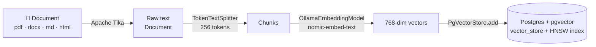

# spring-ai-rag-pgvector

> **A complete RAG system, both halves.** Offline: ingest documents, chunk them, embed
> them locally with Ollama, index the vectors in Postgres/pgvector. Online: retrieve the
> relevant chunks, ground a prompt in them, and let a cloud LLM answer — or honestly say
> *"I don't know."* Built with Spring Boot + Spring AI.


---

## RAG in two halves

Retrieval-Augmented Generation grounds a language model in *your* data. It splits
cleanly into two halves, and — crucially — you can build and test them separately:

| Half | When it runs | What it does | In this repo? |
|------|--------------|--------------|:---:|
| **Offline** (indexing) | once per document | read → chunk → embed → **index** | ✅ |
| **Online** (querying) | once per question | embed question → retrieve → prompt an LLM → **answer** | ✅ |

Both halves are here. The offline half (`/ingest`, `/search`) lets you *see* exactly
what retrieval returns before any generation is involved — that's where RAG quality is
won or lost. The online half (`/ask`) turns those chunks into a grounded answer.

**The architecture is deliberately hybrid:** embeddings run **locally** (Ollama — free,
private, and the vectors never leave your machine), while generation runs in the
**cloud** (DeepSeek — far stronger than a model your box could hold). RAG makes the split
natural: only the retrieved snippets plus the question travel to the rented model.

## The offline pipeline



At **query** time the same embedding model turns your question into a vector, and
pgvector returns the nearest chunks via `ORDER BY embedding <=> :queryVector LIMIT k`.

## Stack

| Concern | Choice | Why |
|---------|--------|-----|
| Framework | Spring Boot 3.5 + Spring AI 1.0.3 | portable AI abstractions, the most-documented GA line |
| Vector store | pgvector (`pgvector/pgvector:pg17`) | it's just Postgres, with a `vector` column type + ANN index |
| Embeddings | Ollama `nomic-embed-text` (768-dim) | runs locally/on a homelab, free, deterministic |
| Chat / generation | DeepSeek `deepseek-v4-flash` | strong cloud LLM; only the retrieved context is sent to it |
| Doc parsing | Apache Tika | one reader for PDF / Word / HTML / Markdown / text |
| DB lifecycle | Spring Boot Docker Compose support | the app starts and wires the DB container itself |

---

## How to run it

**Prerequisites:** JDK 21+ · Docker · [Ollama](https://ollama.com) running locally
(or reachable on your network).

```bash
# 1. Make sure the embedding model is available (the app can also auto-pull it)
ollama pull nomic-embed-text

# 2. Start everything — Spring Boot brings up pgvector via Docker Compose
mvn spring-boot:run
```

That single command:
1. starts the `pgvector` container from `compose.yaml` and waits until it's healthy,
2. enables the `vector` extension (`docker/postgres/init/01-enable-pgvector.sql`),
3. creates the `vector_store` table + HNSW index (`initialize-schema: true`),
4. connects to Ollama and ensures `nomic-embed-text` is present,
5. serves on <http://localhost:8080>.

**Point at a remote Ollama** (e.g. a homelab box) without touching code:

```bash
OLLAMA_BASE_URL=http://<host>:11434 mvn spring-boot:run
```

**Enable the online half (`/ask`).** Copy `.env.example` to `.env` and add your
[DeepSeek API key](https://platform.deepseek.com/api_keys):

```bash
cp .env.example .env      # then edit: DEEPSEEK_API_KEY=sk-...
```

The app boots fine **without** a key — the offline half (`/ingest`, `/search`) works as-is,
and `/ask` just returns the retrieved context with a "chat not configured" note. `.env` is
gitignored, so your key never leaves the machine.

## How to try the endpoints

Import-free options: use the included **Bruno** collection (`/bruno` → *Open Collection*),
or curl directly:

```bash
# Ingest the bundled primer doc (read → chunk → embed → index)
curl -s -X POST http://localhost:8080/rag/ingest/sample

# Ingest your own file — Tika handles PDF, docx, html, md, txt...
curl -s -F "file=@/path/to/your.pdf" http://localhost:8080/rag/ingest

# Search — the retrieval half, laid bare (top-K chunks + similarity scores)
curl -s "http://localhost:8080/rag/search?query=why%20chunk%20documents&topK=4"

# Ask — the full RAG loop: grounded answer + the sources it stood on (needs a DeepSeek key)
curl -s "http://localhost:8080/rag/ask?q=what%20is%20chunking%20and%20why%20does%20it%20matter%3F"
```

| Method | Endpoint | Purpose |
|--------|----------|---------|
| `POST` | `/rag/ingest/sample` | index the bundled `what-is-rag.md` |
| `POST` | `/rag/ingest` | index an uploaded file (multipart field `file`) |
| `GET`  | `/rag/search?query=&topK=` | return the most similar chunks (retrieval only, no LLM) |
| `GET`  | `/rag/ask?q=` | full RAG loop — grounded answer **plus** cited sources |

Ask something the docs *don't* cover and watch it answer `"I don't know."` instead of
hallucinating — that's the grounding prompt fencing the model to your data.

Inspect what got stored:

```bash
docker exec myrag-pgvector-1 psql -U myrag -d myrag \
  -c "SELECT id, left(content,60), metadata FROM vector_store;"
```

---

## How it works — the ingestion pipeline

The whole offline half lives in [`IngestionService`](src/main/java/lu/zakaria/myrag/ingest/IngestionService.java).
It's Spring AI's **ETL pipeline**: `DocumentReader → DocumentTransformer → VectorStore`.

**1. Read (Extract).** `TikaDocumentReader` wraps Apache Tika, which detects the file
type from its bytes and extracts plain text — one API for every format. Output: a
`List<Document>` (usually one big `Document` per file).

**2. Chunk (Transform).** `TokenTextSplitter` breaks the text into passages measured
in *tokens* (via a real BPE tokenizer), not characters — because token budgets are what
embedders actually care about. Chunk size is the single biggest lever on retrieval
quality, so it's configurable (`myrag.chunk.size`, default 256).

**3. Embed + Index (Load).** `vectorStore.add(chunks)` does two things in one call:
it sends each chunk's text to the embedding model, then `INSERT`s the resulting
`(id, content, metadata, embedding)` rows into pgvector. You never write SQL or an
HTTP client — the `VectorStore` abstraction hides both.

> **Why a vector index and not `LIKE '%...%'`?** An embedding maps text to a point in
> 768-dimensional space where *distance ≈ difference in meaning*. So "how do I get my
> money back" lands near a passage about "refund policy" with zero shared keywords.
> The HNSW index keeps nearest-neighbour search fast as the table grows.

## How to tune it

The knobs worth turning first, in `src/main/resources/application.yml`:

```yaml
myrag:
  chunk:
    size: 256        # tokens per chunk — smaller = more focused hits, more rows
    min-chars: 150   # don't emit a chunk shorter than this
```

Retrieval quality depends far more on **chunk size** and the **embedding model** than
on anything downstream. Change `size`, re-ingest, re-search, and watch the scores move.

## How to avoid the common pitfalls

- **Match the vector dimensions to the model.** `nomic-embed-text` emits 768 numbers,
  so `spring.ai.vectorstore.pgvector.dimensions: 768`. A mismatch rejects every insert.
- **Opt into schema init.** `initialize-schema: true` is required in Spring AI 1.0+
  (it used to default on). Without it the `vector_store` table is never created.
- **Label the pgvector service for Boot.** The `pgvector/pgvector` image name doesn't
  contain "postgres", so Boot's Docker Compose support needs
  `org.springframework.boot.service-connection: postgres` in `compose.yaml` to wire it.
- **Re-ingesting appends.** There's no dedupe; `TRUNCATE vector_store;` for a clean slate.
- **Start Ollama before the app.** Ollama is a separate always-on server (like Postgres);
  Spring is only an HTTP client to it.

## How it works — the online half (`/ask`)

The generation loop lives in [`RagChatConfig`](src/main/java/lu/zakaria/myrag/ask/RagChatConfig.java)
and [`AskController`](src/main/java/lu/zakaria/myrag/ask/AskController.java). The entire
retrieve → augment → generate flow hides behind one fluent call:

```java
ChatResponse response = chatClient.prompt().user(q).call().chatResponse();
```

A `QuestionAnswerAdvisor` is attached to the `ChatClient` as a default advisor (an advisor
is an interceptor around the chat call — AOP for prompts). On every call it: (1) runs a
similarity search over the vector store, (2) splices the hits into the prompt via a
template, (3) calls DeepSeek. Two details worth knowing:

- **Grounding is a prompt, not magic.** The template says *"answer from the context and no
  prior knowledge; if it isn't there, say you don't know."* That one rule is the difference
  between a grounded system and a chatbot that hallucinates from training data.
- **Read the sources from the response, don't search twice.** The advisor stashes the chunks
  it retrieved in the `ChatResponse` metadata under `qa_retrieved_documents`. `/ask` reads
  them from there — so it returns *exactly* what the model saw, with **one** retrieval, not
  a second lookup that only happens to match.

> **Two providers, one classpath.** `spring.ai.model.chat=deepseek` and
> `spring.ai.model.embedding=ollama` tell Spring AI which provider backs each model type, so
> the two coexist with no bean clash. `QuestionAnswerAdvisor` needs an extra dependency the
> starters don't pull in: `spring-ai-advisors-vector-store`.

## What's next

The shape is complete; these are the quality/UX knobs left to turn:
1. **Similarity threshold** — drop weak retrievals before they reach the model, so a
   near-empty search can't pad the prompt with noise.
2. **Streaming** — swap `.call()` for `.stream()` to return tokens as they generate.
3. **Inline citations** — point each claim at the exact chunk behind it, not just a source list.

## Project layout

```
src/main/java/lu/zakaria/myrag/
  ├── MyragApplication.java          # Spring Boot entry point
  ├── ingest/                        # the OFFLINE half
  │   ├── IngestionService.java      #   read → chunk → embed → index
  │   └── RagController.java         #   /rag/ingest, /rag/ingest/sample, /rag/search
  └── ask/                           # the ONLINE half
      ├── RagChatConfig.java         #   ChatClient + QuestionAnswerAdvisor + grounding template
      └── AskController.java         #   /rag/ask — grounded answer + sources
src/main/resources/
  ├── application.yml                # Ollama + DeepSeek + pgvector config, chunk knobs
  └── docs/what-is-rag.md            # sample document to ingest
.env.example                         # copy to .env and add DEEPSEEK_API_KEY (gitignored)
compose.yaml                         # pgvector service (+ Boot service-connection label)
docker/postgres/init/               # one-time SQL: CREATE EXTENSION vector
bruno/                               # ready-to-run Bruno API collection
```
